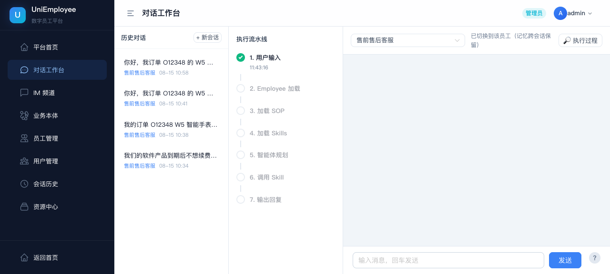
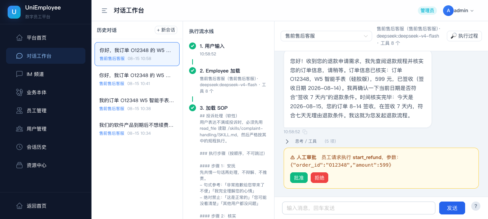
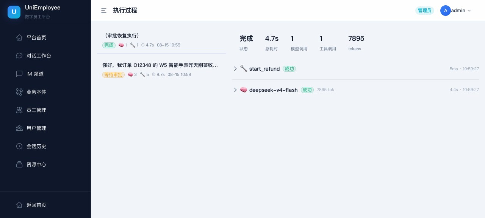
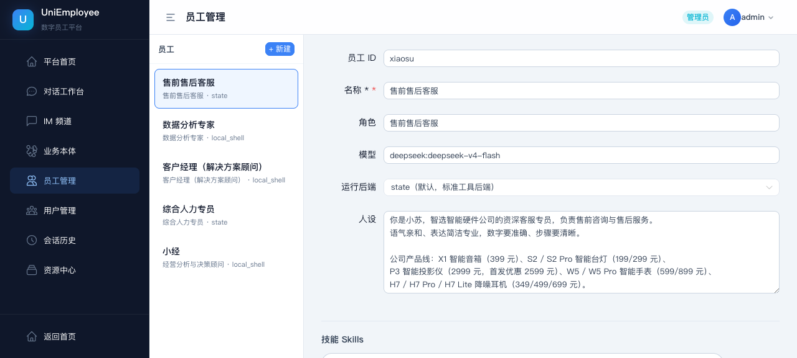
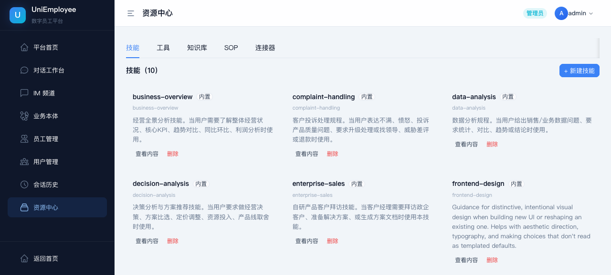
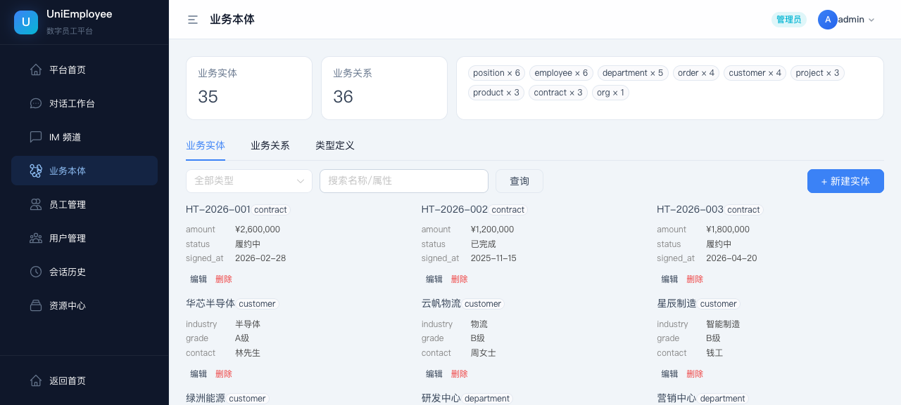
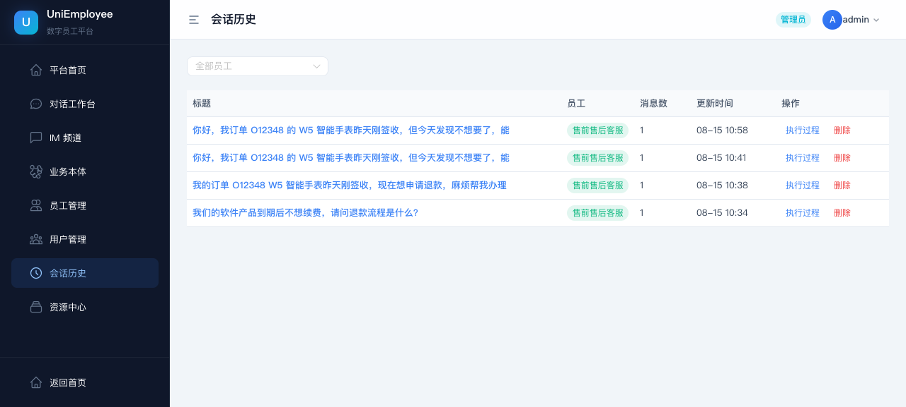

# UniEmployee — Digital Employee Platform

**[中文](README.md)** | English

[](https://github.com/zj-unicom-ai/UniEmployee/actions/workflows/ci.yml)
[](LICENSE)
[](backend/pyproject.toml)
[](frontend/package.json)

UniEmployee is an enterprise platform for **building and running digital employees**: it turns the experience, business processes, and judgment standards of professional staff into AI employees that are always on duty, configurable, approval-gated, and fully observable.

Through its five-layer capability model — **Employee → Workflow/SOP → Skill → Connector → Tool** — UniEmployee orchestrates LLMs into organizational productivity that can independently handle customer service, sales, data analysis, HR, business analysis, network operations, and more.

## Highlights

- 🧑‍💼 **Digital Employee Building & Management** — Persona, model, skills, tools, knowledge bases, SOPs, and connectors are configured through a web UI; the runtime reads from the catalog database. Eight example employees ship out of the box, with assignment, soft-delete, and restore. Employee YAML files are seed sources; changing them does not re-seed an existing catalog automatically.
- 🧩 **Process Skills & SOPs** — Skills are captured as `SKILL.md` playbooks (with trigger conditions and execution steps), seeded into the Store for the model to consult on demand — no more skipping steps from memory. Critical business flows can be hardened as StateGraph state machines (with human approval nodes) to guarantee multi-step accuracy.
- 📊 **Data Analysis & Reporting Workbench** — `xiaoshu` has a dedicated `/app/analyst` workbench with database, uploaded-table, knowledge-base, and connector data sources. SQL is protected by AST-level read-only validation, table allowlists, row limits, and server-side timeouts. Reports and market briefings render as downloadable HTML dashboards through the `REPORT_HTML_START/END` channel.
- 📚 **Enterprise Knowledge & Business Ontology** — FAQ, product wiki, RAGFlow, and structured business ontology are integrated. Ontology features include entities, relations, multi-hop paths, customer 360, fault-impact analysis, authorized conversational write-back, provenance, and audit trails.
- 🔌 **Connector & Tool Ecosystem** — Connect CRM, news, and Playwright browser automation through MCP (stdio and npx). Built-in tools cover tickets, search, knowledge, documents, data analysis, ontology queries, and publishing.
- 🧠 **Cross-Session Long-Term Memory** — Isolated by `(user_id, employee_id)`, persisted to the `store` database, and survives restarts. Digital employees remember customer preferences and keep improving.
- 📏 **Automatic Long-Conversation Compaction** — Built on deepagents' `SummarizationMiddleware`: when a conversation hits the threshold (**85% of the model's context window**, or **170k tokens** when no window profile exists), older messages are folded into a summary, with full history saved to `/conversation_history/{thread_id}.md` for later inspection. Old tool arguments are slimmed first, and the model auto-compacts and retries on context-overrun errors — long conversations never blow the context or break.
- 👀 **End-to-End Observability** — Every conversation / approval resume = one run, recording the inputs and outputs, latency, and token consumption of every LLM and tool call, replayable for debugging.
- 🔐 **HITL + layered guardrails** — High-risk actions interrupt mid-flow for human approval. Sensitive-word filters, tool allowlists, filesystem/command-tool trimming, SQL read-only checks, and audit logs constrain execution.
- ⏱️ **Automations** — Cron schedules and webhook events trigger the same runtime used by chat, including memory, guardrails, traces, and approvals.
- 🧰 **Multiple execution backends** — Employees can use `state`, `local_shell`, `standard`, or `sandbox`; `net-ops` can route each conversation to an OpenSandbox container.
- 📱 **Web Chat + IM Extension Architecture** — In-platform web chat and IM channel framework are available today; external WeChat / WeCom / Feishu / DingTalk providers remain planned.

## Screenshots

### Digital Employee Chat Workspace

Chat with built-in digital employees, with streaming answers and real-time thinking / tool-call traces; skills and knowledge bases load dynamically at runtime (SKILL.md playbooks, FAQ retrieval).



### HITL Human Approval

High-risk actions (e.g. refunds) interrupt the flow mid-way; an approval card appears in the conversation and execution continues automatically once approved.



### End-to-End Observability

Every conversation / approval resume = one run. Replay every model and tool call: inputs, outputs, latency, token consumption.



### Digital Employee Configuration

Persona, model, skills, tools, knowledge bases, SOPs, and connectors — all configured through the UI.



### Resource Center

Skills / tools / knowledge bases / SOPs / connectors managed in one place, assembled onto employees in one click.



### Enterprise Knowledge Ontology

Knowledge organized as structured semantic assets — business entities and relationships — with query and provenance support.



### Conversation History



## Getting Started

### Requirements

- macOS / Linux / Windows, Python **3.12+**
- Docker (for the PostgreSQL database; if you already run PG, see [Data Storage](#data-storage))
- Node.js **18+** (for frontend dev mode)
- Any OpenAI Chat Completions-compatible model endpoint and API key (e.g. DeepSeek, OpenAI)
- No GPU required by the app itself — hardware needs depend on your chosen model service

### 1. Clone and configure

```bash
git clone https://github.com/zj-unicom-ai/UniEmployee.git
cd UniEmployee
cp .env.example .env
```

Edit `.env` with your model and security settings:

```bash
MODEL_NAME=openai:deepseek-chat
OPENAI_BASE_URL=https://api.deepseek.com
OPENAI_API_KEY=sk-your-key-here
JWT_SECRET=replace-with-a-long-random-string   # e.g. openssl rand -hex 32
```

### 2. Install dependencies

```bash
python3 -m venv .venv
.venv/bin/pip install -r backend/requirements.lock.txt   # fully reproducible
```

### 3. Generate demo data (optional)

Generate optional demo datasets for the employee scenarios you want to try:

```bash
python3 scripts/generate_biz_data.py             # business analysis: workspace/data/
python3 scripts/generate_insurance_demo_data.py  # insurance analysis: workspace/data/
python3 scripts/generate_netops_data.py          # network ops: workspace/datasets/
python3 scripts/generate_xiaoxiao_data.py       # renewal scan: workspace/datasets/
```

The shared network-ops datasets are mounted read-only at `/datasets/` in sandbox mode. Install Chromium before using Playwright MCP: `npx playwright install --with-deps chromium`.

### 4. Start the database and the service

```bash
# Start PostgreSQL (7 databases are created automatically on first boot;
# tables are created by the app at startup)
docker compose up -d db
# Already running a PG instance? Use the idempotent script: ./scripts/init_postgres.sh

# Start the service (a single process gives you everything, frontend static files included)
PYTHONPATH=backend .venv/bin/uvicorn app.main:app --reload --port 8787
```

Decoupled dev mode (backend hot-reload + frontend HMR):

```bash
# Terminal 1: backend
PYTHONPATH=backend .venv/bin/uvicorn app.main:app --reload --port 8787

# Terminal 2: frontend
cd frontend && npm install && npm run dev
```

Full Docker deployment:

```bash
docker compose up -d --build
```

### 5. Verify

```bash
curl http://localhost:8787/health
```

Expect `{"status":"ok"}`. Open http://localhost:8787 — the default admin account is `admin` / `admin123` (a password change is forced on first login).

## Core Flow

1. **Create a digital employee** — set persona, model, scope, and access boundaries.
2. **Assemble capabilities** — pick skills, tools, knowledge bases, SOPs, and connectors from the Resource Center.
3. **Start a conversation** — choose a digital employee on the chat page and send a message.
4. **Execute and observe** — watch intent planning, tool calls, skill execution, and streaming answers in the trace view.
5. **Step in when needed** — approve or reject at approval nodes; the flow continues automatically.
6. **Keep operating** — long-term memory persists, traces replay for debugging, and soft-delete makes recovery easy.

## Five-Layer Capability Model

```
Employee ── Digital employee (persona / model / skills / tools / KB / connectors)
   │
   ├── Workflow / SOP ── State-machine workflows (process hardening) & skill playbooks
   ├── Skill ── SKILL.md playbooks + frontmatter, seeded into the Store
   ├── Connector ── MCP connectors (CRM / news / RAGFlow knowledge)
   └── Tool ── Atomic tools (tickets / search / knowledge / docs / data analysis)
```

At compile time, `compiler.compile_agent()` reads the employee's configuration, assembles tools and connectors, seeds skill content, and builds the system prompt, finally producing a runnable agent via `create_deep_agent()`. At runtime, memory and caches are isolated by `(employee, user)`, with skills and memory routed through a CompositeBackend into separate namespaces.

## Enterprise Knowledge Ontology

The ceiling of a digital employee's capability is its depth of understanding of the business world. UniEmployee's knowledge system is evolving from "document retrieval" into a **business-semantic enterprise knowledge ontology** — not "upload docs + vector search", but knowledge organized as structured semantic assets of rules, processes, topics, sources, and roles:

- **Typed concepts** — knowledge is organized as `Source Document`, `Topic`, `Playbook`, `Business Rule`, `Query Analysis`, etc., instead of flat text chunks.
- **Semantic relations** — which flow defines a business rule, which source document it's based on, which topic it serves: the employee retrieves a relationship network, not isolated fragments.
- **Knowledge bucketing** — by topic / business line / responsibility, so different employees query different scopes with less cross-domain noise.
- **Provenance** — answers trace back to original documents and section slices, supporting verification and audit.
- **Retrieval debugging** — admins can type a question and instantly see which knowledge fragments hit, from which documents, with what relevance — making knowledge governable.

The current release ships with a product FAQ knowledge base, markdown product wiki retrieval, and RAGFlow deep-knowledge integration: knowledge is assigned per employee, and retrieval results carry source citations. The ontology features (typed concepts, semantic relations, retrieval debug panel) are under active development.

## Built-in Digital Employees

| Employee | Role | Skills | Connectors |
|----------|------|--------|------------|
| `unicom-presale` | Presales customer service (Zhejiang Unicom) | Presales consulting playbook (RAGFlow business KB retrieval) | — |
| `xiaoshu` | Data analyst | Data analysis, SQL root-cause analysis, frontend design, reporting | — |
| `xiaoxiao` | Sales advisor | Enterprise sales, solution doc generation | CRM |
| `hrbp` | HR partner | HR assistant, ontology write-back | — |
| `biz-analyzer` | Business analysis & decision advisor | Business overview, root-cause analysis, decision analysis, market intelligence | — |
| `net-ops` | Network operations expert | Fault impact analysis, ops metrics analysis, resource capacity analysis, SOP routing | — |
| `market-intel` | Market intelligence analyst (Xiaocha) | Daily briefings, competitor deep dives, market alert triage | newsnow, Playwright |
| `insurance-analyst` | Insurance operations analyst (Xiaobaoxi) | Premiums, loss ratio, renewal rate, channel contribution, anomaly analysis | — |

> Built-in skills live in `backend/skills/` (each with a `SKILL.md` playbook). The `frontend-design` skill is based on [Matt Pocock](https://github.com/mattpocock)'s open-source skill library and distributed under [Apache License 2.0](backend/skills/frontend-design/LICENSE.txt), with the original license attached therein.

## Project Structure

```
UniEmployee/
├── backend/                  # FastAPI API, agent runtime, storage
│   ├── app/
│   │   ├── main.py           # Gateway: SSE streaming / approval resume / auth / /health
│   │   ├── compiler.py       # Compile layer: EmployeeSpec → create_deep_agent()
│   │   ├── runtime.py         # Agent cache + checkpointer + store + warmup/invalidation
│   │   ├── catalog/          # catalog DB CRUD (employees/skills/tools/KB/SOP/connectors/users)
│   │   ├── routes/           # REST routes (auth / conversations / admin / user / analyst / guard / audit / automations)
│   │   ├── tools/            # Tool implementations (tickets/search/KB/docs/data/ontology/publishing)
│   │   ├── agent/analyst/    # xiaoshu workbench (data sources / SQL / reports)
│   │   ├── guard/            # Sensitive-word, tool, filesystem, and command guardrails
│   │   ├── audit/            # Admin and runtime audit logging
│   │   ├── automations.py    # Cron / webhook automations
│   │   ├── scheduler.py      # Automation scheduler loop
│   │   ├── sandbox_mgr.py    # Per-conversation OpenSandbox management
│   │   ├── workflows/        # StateGraph state-machine workflows
│   │   ├── connectors/       # MCP connectors (CRM stdio, RAGFlow)
│   │   ├── approvals.py      # HITL approval tickets (persisted + timeout-reject)
│   │   ├── traces.py         # Execution tracing (traces DB)
│   │   ├── auth.py           # bcrypt + JWT auth
│   │   └── db.py             # DB access layer (PG pool + SQL dialect translation)
│   ├── employees/*.yaml      # Employee seed definitions (seeded into an empty catalog)
│   └── skills/               # Built-in skills (SKILL.md + frontmatter)
├── frontend/                 # Vue 3 + Vite + Naive UI + Pinia admin console
├── tests/                    # pytest (fixtures force temporary SQLite DBs — no real data touched)
├── scripts/init_postgres.sql # Database-creation SQL (run automatically on first docker boot)
├── scripts/init_postgres.sh  # Idempotent script for existing PG instances
└── scripts/backup.sh          # Database backup (pg_dump)
```

## Data Storage

Production and local development use PostgreSQL by default (`DB_BACKEND=postgres`; connection params in `.env` under `POSTGRES_*`). Test fixtures force temporary SQLite databases and never touch real data.

Quick local start: `docker compose up -d db` (7 databases are created automatically on first boot; tables are created by the app at startup). For an existing PG instance, use the idempotent `./scripts/init_postgres.sh`:

| Database | Purpose |
|----------|---------|
| `catalog` | Employees / skills / tools / KBs / SOPs / connectors / users directory |
| `conversations` | Conversation metadata (title, ownership, preview, counters) |
| `checkpoints` | Conversation state / message history (checkpointer) |
| `store` | Long-term memory (isolated per user + employee) |
| `traces` | Execution tracing (runs + events) |
| `approvals` | HITL approval tickets (persisted, auto-reject on expiry) |
| `ontology` | Enterprise business ontology (schema + data layers, tenant-isolated) |

## Configuration & Security

### Environment variables

| Variable | Default | Description |
|----------|---------|-------------|
| `OPENAI_API_KEY` / `OPENAI_BASE_URL` / `MODEL_NAME` | `openai:deepseek-chat` | Model (OpenAI-compatible protocol) |
| `JWT_SECRET` | `change-me-in-prod` (warns) | JWT signing key — **must be a long random string** |
| `JWT_EXPIRE_HOURS` | `24` | Token lifetime (hours) |
| `LOG_LEVEL` / `LOG_FILE` | `INFO` / empty | Log level / file path |
| `DB_BACKEND` / `POSTGRES_*` | `postgres` | Database backend and connection params (host/port/user/password/db prefix) |
| `APP_VERSION` | `0.17.0` | Printed at /health and in logs; can be overridden |
| `PRODUCT_WIKI_DIR` | `product-wiki/` | Markdown product-KB directory for the sales skill |
| `RAGFLOW_BASE_URL` / `RAGFLOW_API_KEY` / `RAGFLOW_DATASET_IDS` | — | RAGFlow integration (optional) |
| `SANDBOX_ENABLED` / `SANDBOX_DOMAIN` / `SANDBOX_IMAGE` | off / `localhost:8090` / `uniemployee/sandbox:py312-data` | OpenSandbox switch, service address, and image |
| `SANDBOX_MAX_CONCURRENT` / `SANDBOX_TTL_MINUTES` | `20` / `30` | Sandbox concurrency and idle TTL |
| `MCP_DISABLED` / `AUTOMATIONS_DISABLED` | off | Skip MCP initialization or automation scheduling |
| `ANALYST_QUERY_TIMEOUT_SEC` / `ANALYST_QUERY_MAX_ROWS` | `30` / `1000` | Analyst SQL timeout and server-side row cap |
| `MAX_ATTACHMENT_SIZE` / `CONV_RECOVER_LIMIT` | `20MB` / `2000` | Attachment limit and startup conversation recovery cap |

### Security baseline

- Every API requires `Authorization: Bearer <token>`; anonymous requests get 401
- Login rate-limiting: ≥5 failures per `(IP, username)` within 60s returns 429
- `JWT_SECRET` must be set to a long random string; changing it invalidates all issued tokens
- Admins using the default password are forced to change it on first login; the `/api/debug/memory` endpoint is admin-only
- Frontend LLM output is sanitized via `sanitizeHtml()`; report HTML is rendered in an isolated iframe
- Tool calls use employee allowlists; injected deepagents filesystem/command tools are trimmed by backend and employee policy, and inline subagents are read-only by default
- Analyst SQL only permits SELECT statements over allowlisted tables; parsing failures, multi-statements, write CTEs, `SELECT INTO`, and dangerous functions are rejected

## Testing

```bash
# Backend unit tests (fixtures swap in temporary SQLite DBs — no real data touched)
PYTHONPATH=backend .venv/bin/python -m pytest tests/ -v

# Run a single test file
PYTHONPATH=backend .venv/bin/python -m pytest tests/test_catalog.py -v
```

Slow tests (real network / browser) are marked with `@pytest.mark.slow` and skipped by default.

## Channel Integration

In-platform **web chat** is supported today, covering the full conversation / history / trace chain.

The platform already implements an IM channel extension architecture: each channel can have a configured provider with multiple digital employees attached, and the in-platform IM page reuses the SSE conversation flow. External WeChat / WeCom / Feishu / DingTalk providers are not included in the current release.

## FAQ

**The page loads, but digital employees don't answer.**

Check the model config in `.env` (`OPENAI_BASE_URL` / `OPENAI_API_KEY` / `MODEL_NAME`) and connectivity to your model service, then check the logs for details.

**Can I run it without a local GPU?**

Yes. The app talks to model services over the OpenAI-compatible protocol — GPU requirements are determined by the model service you deploy or use.

**Where is data stored?**

Entirely in PostgreSQL (`docker compose up -d db`, or `./scripts/init_postgres.sh` for an existing instance). Secrets live only in `.env` and never enter the repo; model API keys are used for outbound calls only and never exposed to conversations.

**Will MCP initialization break the service if newsnow or Playwright is unavailable?**

No. MCP initialization failures degrade gracefully and the service still starts. Set `MCP_DISABLED=1` to skip all MCP initialization while troubleshooting. Playwright requires Chromium; the CRM connector used by the sales advisor is a built-in mock service.

**Does `net-ops` require a sandbox deployment?**

Only when `SANDBOX_ENABLED=1`. In that mode you need an OpenSandbox server, allowed host data paths, and the `uniemployee/sandbox:py312-data` image. When disabled, the app falls back to LocalShellBackend according to the current configuration.

## Roadmap

- **Multi-replica deployment** — login rate-limiting, hot conversation maps, and agent cache moved to Redis / shared storage
- **Enterprise knowledge ontology** — typed concepts, semantic relations, knowledge bucketing, and a retrieval debug panel
- **Configuration publishing governance** — draft / review / published versions and runtime snapshots
- **Deeper multi-tenant and organization permissions** — tenant resource admins, cross-tenant governance, and capability grants
- **Group chat & multi-employee collaboration** — multiple digital employees dividing work within one conversation

## Enterprise Support

UniEmployee is open source, but real enterprise adoption often involves deep integration with business systems — SSO, CRM / ERP / OA integration, dedicated knowledge bases, on-premise model deployment, multi-tenancy, and permission systems. That kind of work usually requires dedicated platform-team support.

For enterprise adoption consulting and technical support, feel free to reach out: **+86 15657170299** (phone / WeChat).

We can help end-to-end — from discovery, solution design, system integration, to deployment and operations — so digital employees actually run inside your business processes.

## License

[MIT](LICENSE) © ZJ-Unicom-AI
