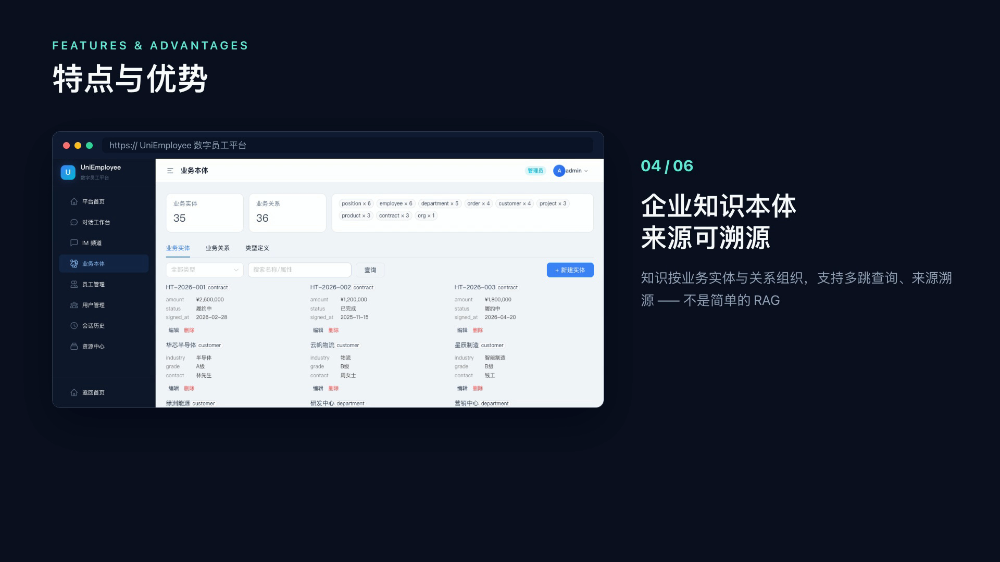

# UniEmployee 数字员工平台

中文 | **[English](README.en.md)**

[](https://github.com/zj-unicom-ai/UniEmployee/actions/workflows/ci.yml)
[](LICENSE)
[](backend/pyproject.toml)
[](frontend/package.json)

## 关于 UniEmployee

UniEmployee 是一套面向企业的**数字员工构建与运行平台**：把专业员工的工作经验、业务流程和判断标准，固化为可随时上岗、可配置、可审批、可观测的 AI 数字员工。通过 **Employee → Workflow/SOP → Skill → Connector → Tool** 五层能力模型，把大模型编排成能独立承担客服、销售、数据分析、HR、经营分析和网络运营等岗位工作的组织生产力，而不是零散的个人效率工具。

## 核心亮点

- 🧑‍💼 **数字员工构建与管理**：人设、模型、技能、工具、知识库、SOP、连接器全部页面化配置，运行时以 catalog 目录库为准；内置 8 个示例员工，支持员工分配、软删除与恢复。注意：`backend/employees/*.yaml` 是种子源，已有 catalog 库不会因修改 YAML 自动全量重播种。
- 🧩 **流程型技能与 SOP**：技能以 `SKILL.md` 规程沉淀（含触发条件与执行步骤），播种进 Store 供模型按需查阅，不凭记忆跳过；关键业务流程可用 StateGraph 状态机固化（含人工审批节点），保证多步流程准确执行。
- 📊 **数据分析与报告工作台**：小数（`xiaoshu`）拥有独立的 `/app/analyst` 工作台，支持数据库、附件表格、知识库和连接器数据源；SQL 查询采用 AST 级只读校验、表白名单、行数上限和服务端超时。分析报告与市场简报可通过 `REPORT_HTML_START/END` 通道渲染为可下载、可新窗口打开的 HTML 看板。
- 📚 **企业知识与业务本体**：已接入 FAQ、产品 Wiki、RAGFlow 多源知识与结构化企业本体；本体支持实体/关系管理、多跳路径、客户 360、故障影响分析以及经授权的对话写回，并保留来源和审计信息。
- 🔌 **连接器与工具生态**：通过 MCP 标准接入 CRM、新闻和 Playwright 浏览器自动化等外部系统（stdio 与 npx 两种形态），内置工单、搜索、知识库、文档生成、数据分析、本体查询等原子工具。
- 🧠 **跨会话长期记忆**：按 `(user_id, employee_id)` 隔离，落盘 Store 数据库，重启不丢；数字员工记住客户偏好并持续迭代。
- 📏 **超长对话自动压缩**：基于 deepagents 内置 `SummarizationMiddleware`，对话到达阈值（有模型上下文画像按 **85% 窗口比例**触发，否则按 **17 万 token**）时自动把旧消息折叠为摘要，完整历史落盘 `/conversation_history/{thread_id}.md` 可随时回读；消息一多先对旧工具参数瘦身、模型报超预算时自动压缩重试，长对话不爆上下文、不中断。
- 👀 **全链路可观测**：每次对话 / 审批恢复 = 一条 run，记录 LLM 与工具调用的输入输出、耗时、token 消耗，可回放定位。
- 🔐 **HITL + 多层安全护栏**：高风险动作触发流程中途中断，等待人工批准后自动继续；敏感词、工具白名单、内置文件/命令工具裁剪、SQL 只读校验和审计日志共同限制越权执行。
- ⏱️ **自动任务**：支持 cron 定时和 webhook 事件触发，执行链路复用对话运行时的记忆、护栏、Trace 和审批能力，结果可回到会话继续追问或经审批后发布。
- 🧰 **多执行后端**：按员工选择 `state`、`local_shell`、`standard` 或 `sandbox` 后端；`net-ops` 可按会话路由到 OpenSandbox 容器，未启用沙箱时按当前配置回退本地后端。
- 📱 **Web 聊天 + IM 扩展架构**：当前支持平台内 Web 聊天和平台内 IM 频道框架；微信 / 企业微信 / 飞书 / 钉钉等外部渠道仍在规划中。

## 功能演示

一分钟视频速览 UniEmployee：数字员工对话工作台（流式回答、思考与工具调用过程实时可见）、HITL 人工审批、全链路执行 Trace、员工与资源中心配置、企业知识本体。

[](assets/UniEmployee.mp4)

> 点击封面播放完整视频（约 1 分 20 秒），或[直接打开视频文件](assets/UniEmployee.mp4)。

## 目录

- [功能演示](#功能演示)
- [快速开始](#快速开始)
- [核心流程](#核心流程)
- [五层能力模型](#五层能力模型)
- [企业知识本体](#企业知识本体)
- [内置数字员工](#内置数字员工)
- [项目结构](#项目结构)
- [数据存储](#数据存储)
- [配置与安全](#配置与安全)
- [测试](#测试)
- [渠道接入](#渠道接入)
- [常见问题](#常见问题)
- [路线图](#路线图)
- [企业落地技术支撑](#企业落地技术支撑)
- [许可证](#许可证)

## 文档导航

| 我想要 | 去哪里 |
|---|---|
| 部署 / 备份 / 排障 | [docs/guide/deployment.md](docs/guide/deployment.md) |
| 全部环境变量说明 | [docs/guide/configuration.md](docs/guide/configuration.md) |
| 新增一个数字员工 | [docs/guide/add-employee.md](docs/guide/add-employee.md) |
| 编写技能规程（SKILL.md） | [docs/guide/skill-authoring.md](docs/guide/skill-authoring.md) |
| 开发自定义工具 | [docs/guide/custom-tools.md](docs/guide/custom-tools.md) |
| 参与贡献 / 发布流程 | [CONTRIBUTING.md](CONTRIBUTING.md) |
| 平台原理深度解读（8 篇系列） | [docs/articles](docs/articles/README.md) |
| 当前版本与变更记录 | [CHANGELOG.md](CHANGELOG.md) |
| 开发约束与架构注意事项 | [AGENTS.md](AGENTS.md) |

## 快速开始

### 环境要求

- macOS / Linux / Windows，Python **3.12+**
- Docker（起 PostgreSQL 数据库；已有 PG 实例可不装，见「数据存储」）
- Node.js **18+**（前端开发模式需要）
- 任意 OpenAI Chat Completions 兼容的模型接口与 API Key（如 DeepSeek、OpenAI）
- 应用本身不需要 GPU，硬件要求取决于你选择的模型服务

### 1. 克隆并配置

```bash
git clone https://github.com/zj-unicom-ai/UniEmployee.git
cd UniEmployee
cp .env.example .env
```

编辑 `.env`，填入模型与安全密钥：

```bash
MODEL_NAME=openai:deepseek-chat
OPENAI_BASE_URL=https://api.deepseek.com
OPENAI_API_KEY=sk-your-key-here
JWT_SECRET=请替换为足够长的随机字符串   # 可用 openssl rand -hex 32 生成
```

### 2. 安装依赖

```bash
python3 -m venv .venv
.venv/bin/pip install -r backend/requirements.lock.txt   # 完全可复现
```

### 3. 生成演示数据（可选）

需要演示数据的员工依赖 `workspace/data/` 或 `workspace/datasets/` 下的模拟数据集。本地体验可按场景生成：

```bash
python3 scripts/generate_biz_data.py             # 经营分析：workspace/data/
python3 scripts/generate_insurance_demo_data.py  # 保险分析：workspace/data/
python3 scripts/generate_netops_data.py          # 算网运营：workspace/datasets/
python3 scripts/generate_xiaoxiao_data.py       # 客户经理续约扫描：workspace/datasets/
```

`net-ops` 的共享数据集在沙箱内以只读方式挂载到 `/datasets/`；使用 Playwright MCP 前还需执行 `npx playwright install --with-deps chromium`。

### 4. 启动数据库与服务

```bash
# 起 PostgreSQL（首次启动自动建 7 个业务库；表结构由应用启动时自动创建）
docker compose up -d db
# 已有 PG 实例可改用幂等建库脚本：./scripts/init_postgres.sh

# 启动服务（单进程即可全功能，内置前端静态文件）
PYTHONPATH=backend .venv/bin/uvicorn app.main:app --reload --port 8787
```

前后端分离开发模式（后端热重载 + 前端 HMR）：

```bash
# 终端 1：后端
PYTHONPATH=backend .venv/bin/uvicorn app.main:app --reload --port 8787

# 终端 2：前端
cd frontend && npm install && npm run dev
```

Docker 一键部署：

```bash
docker compose up -d --build
```

### 5. 验证安装

```bash
curl http://localhost:8787/health
```

预期返回 `{"status":"ok"}`。打开 http://localhost:8787，默认管理员账号 `admin` / `admin123`，首次登录强制改密。

## 核心流程

1. **创建数字员工**：设置人设、模型、岗位边界与访问范围。
2. **配置员工能力**：从资源中心选择技能、工具、知识库、SOP 与连接器。
3. **发起会话**：进入聊天页选择数字员工并发送消息。
4. **执行并观测**：在执行记录中实时查看意图规划、工具调用、技能执行与流式回答。
5. **必要时介入**：遇到审批节点时人工批准 / 拒绝，流程自动继续。
6. **持续运营**：长期记忆落盘沉淀，Trace 回放定位问题，软删除便于恢复。

## 五层能力模型

```
Employee ── 数字员工（人设 / 模型 / 技能 / 工具 / 知识库 / 连接器装配）
   │
   ├── Workflow / SOP ── 状态机工作流（流程固化）与技能规程
   ├── Skill ── 技能（SKILL.md 规程 + frontmatter，播种进 Store）
   ├── Connector ── MCP 连接器（CRM / 新闻 / RAGFlow 知识库）
   └── Tool ── 原子工具（工单 / 搜索 / 知识库 / 文档生成 / 数据分析）
```

编译期 `compiler.compile_agent()` 读取 catalog 中的员工配置，按需装配工具与连接器、拼接 system_prompt，最终经 `create_deep_agent()` 生成可运行 agent；运行时按 `(employee, user, model)` 缓存并隔离记忆，技能与记忆通过 CompositeBackend 路由到不同命名空间。资源中心修改人设、工具或连接器后，通常需要重启服务使已缓存的 agent 重新编译；技能正文和知识库内容则按运行时机制动态读取。

## 企业知识本体

数字员工的能力上限，取决于它对业务世界的理解深度。UniEmployee 的知识体系正从"文档检索"演进为**带业务语义的企业知识本体**——不是"上传文档 + 向量检索"，而是把企业知识组织为规则、流程、主题、来源与角色之间的结构化语义资产：

- **概念类型化**：知识按 `Source Document`（源文档）、`Topic`（主题）、`Playbook`（操作手册 / 规程）、`Business Rule`（业务规则）、`Query Analysis`（查询分析）等类型组织，而非平铺的文本块。
- **语义关联**：一条业务规则由哪个流程定义、依据哪份源文档、服务于哪个主题，数字员工检索到的是关系网络，而不是孤立片段。
- **知识分桶**：按主题 / 业务线 / 职责分桶，不同数字员工调用不同知识范围，减少跨域串扰。
- **来源溯源**：回答可回到原始文档与章节切片，支持核验与审计。
- **检索调试**：管理员可直接输入问题，实时查看命中了哪些知识片段、来自哪些文档、相关度如何，知识结果可治理。

当前版本已内置产品 FAQ 知识库、markdown 产品 Wiki 检索、RAGFlow 深度知识库和结构化企业本体：知识按员工分配，检索结果标注来源；本体支持 schema、实体、关系、多跳路径和场景化查询。更完整的实体关系与演示问题见 [企业业务本体演示问题清单](docs/guide/ontology-demo-scenarios.md)。

## 内置数字员工

| 员工 | 岗位 | 技能 | 连接器 |
|------|------|------|--------|
| `unicom-presale` | 售前客服（浙江联通） | 售前咨询规程（RAGFlow 业务知识库检索） | — |
| `xiaoshu` | 数据分析专家 | 数据分析、SQL 归因、前端设计、报告生成 | — |
| `xiaoxiao` | 客户经理（解决方案顾问） | 企业销售、方案文档、拜访纪要、客户 360、续约与商机扫描 | CRM |
| `hrbp` | HR 合作伙伴 | HR 助手、本体事实写回 | — |
| `biz-analyzer` | 经营分析与决策顾问 | 经营全景、归因分析、决策分析、市场情报 | — |
| `net-ops` | 算网运营专家 | 故障影响分析、运营指标分析、资源容量分析、SOP 路由执行 | — |
| `market-intel` | 市场情报分析师（小察） | 市场简报、竞品深挖、市场预警分级 | newsnow、Playwright |
| `insurance-analyst` | 保险经营分析数字员工（小保析） | 保费收入、赔付率、续保率、渠道贡献、机构异常分析 | — |

> 内置技能存于 `backend/skills/`（各含 `SKILL.md` 规程）。其中 `frontend-design` 技能基于 [Matt Pocock](https://github.com/mattpocock) 的开源技能库编写，按 [Apache License 2.0](backend/skills/frontend-design/LICENSE.txt) 分发，其内独立附带原始许可证。

## 项目结构

```
UniEmployee/
├── backend/                  # FastAPI 接口、Agent 运行时、存储
│   ├── app/
│   │   ├── main.py           # 网关：SSE 流 / 审批恢复 / 鉴权 / /health
│   │   ├── compiler.py       # 编译层：EmployeeSpec → create_deep_agent()
│   │   ├── runtime.py        # agent 缓存 + checkpointer + store + 预热/失效
│   │   ├── catalog/          # catalog.db CRUD（员工/技能/工具/知识库/SOP/连接器/用户）
│   │   ├── routes/           # REST 路由（auth / conversations / admin / user / im / analyst / guard / audit / automations）
│   │   ├── tools/            # 工具实现（工单/搜索/知识库/文档/数据/本体/发布）
│   │   ├── agent/analyst/    # 小数数据分析工作台（数据源 / SQL / 报告）
│   │   ├── guard/            # 敏感词、工具与内置文件/命令工具护栏
│   │   ├── audit/            # 管理操作与运行相关审计
│   │   ├── automations.py    # cron / webhook 自动任务
│   │   ├── scheduler.py      # 自动任务调度循环
│   │   ├── sandbox_mgr.py    # OpenSandbox 会话级沙箱管理
│   │   ├── workflows/        # StateGraph 状态机工作流
│   │   ├── connectors/       # MCP 连接器（CRM stdio、RAGFlow）
│   │   ├── approvals.py      # HITL 审批单（持久化 + 超时拒绝）
│   │   ├── traces.py         # 执行追踪（traces 库）
│   │   ├── auth.py           # bcrypt + JWT 鉴权
│   │   └── db.py             # 数据库访问层（PG 连接池 + SQL 方言翻译）
│   ├── employees/*.yaml      # 员工种子定义（首次空库启动写入 catalog 库）
│   └── skills/               # 内置技能（SKILL.md + frontmatter）
├── frontend/                 # Vue 3 + Vite + Naive UI + Pinia 管理后台
├── tests/                    # pytest（夹具强制 sqlite 临时库，不碰真实数据）
├── docs/                     # 技术文档：guide/（实操手册）+ articles/（原理解读系列）
├── scripts/init_postgres.sql # 建库 SQL（docker 首次启动自动执行）
├── scripts/init_postgres.sh  # 幂等建库脚本（已有 PG 实例用）
└── scripts/backup.sh         # 数据库备份（pg_dump）
```

## 数据存储

生产和本地开发默认使用 PostgreSQL（`DB_BACKEND=postgres`，连接参数见 `.env` 的 `POSTGRES_*`）；测试夹具会强制使用临时 SQLite，不会碰真实数据。
本地快速起库：`docker compose up -d db`（首次启动自动建 7 个业务库，表结构由应用启动时自动创建）；
已有 PG 实例用 `./scripts/init_postgres.sh` 幂等建库：

| database | 作用 |
|------|------|
| `catalog` | 员工 / 技能 / 工具 / 知识库 / SOP / 连接器 / 用户 目录 |
| `conversations` | 会话元数据（标题、归属、预览、计数） |
| `checkpoints` | 对话状态 / 消息历史（checkpointer） |
| `store` | 长期记忆（按 user + 员工隔离） |
| `traces` | 执行过程追踪（runs + events） |
| `approvals` | HITL 审批单（持久化，带过期自动拒绝） |
| `ontology` | 企业业务本体（schema + data 两层，按租户隔离） |

## 配置与安全

### 环境变量

| 变量 | 默认 | 说明 |
|------|------|------|
| `OPENAI_API_KEY` / `OPENAI_BASE_URL` / `MODEL_NAME` | `openai:deepseek-chat` | 模型（OpenAI 兼容协议） |
| `JWT_SECRET` | `change-me-in-prod`（告警） | JWT 签名密钥，**必须改成长随机串** |
| `JWT_EXPIRE_HOURS` | `24` | token 有效期（小时） |
| `LOG_LEVEL` / `LOG_FILE` | `INFO` / 空 | 日志级别 / 文件路径 |
| `DB_BACKEND` / `POSTGRES_*` | `postgres` | 数据库后端与连接参数（host/port/user/password/db 前缀） |
| `APP_VERSION` | `0.19.0` | 打印在 /health 与日志；可用环境变量覆盖 |
| `PRODUCT_WIKI_DIR` | `product-wiki/` | 销售技能的产品知识库 markdown 目录 |
| `RAGFLOW_BASE_URL` / `RAGFLOW_API_KEY` / `RAGFLOW_DATASET_IDS` | — | RAGFlow 知识库接入（可选） |
| `SANDBOX_ENABLED` / `SANDBOX_DOMAIN` / `SANDBOX_IMAGE` | 未启用 / `localhost:8090` / `uniemployee/sandbox:py312-data` | OpenSandbox 开关、服务地址和沙箱镜像 |
| `SANDBOX_MAX_CONCURRENT` / `SANDBOX_TTL_MINUTES` | `20` / `30` | 沙箱并发上限与空闲回收时间 |
| `MCP_DISABLED` / `AUTOMATIONS_DISABLED` | 未启用 | 分别跳过 MCP 初始化或自动任务调度 |
| `ANALYST_QUERY_TIMEOUT_SEC` / `ANALYST_QUERY_MAX_ROWS` | `30` / `1000` | 数据分析 SQL 超时与服务端返回行数上限 |
| `MAX_ATTACHMENT_SIZE` / `CONV_RECOVER_LIMIT` | `20MB` / `2000` | 附件大小与服务启动时会话恢复上限 |

### 安全基线

- 所有接口必须携带 `Authorization: Bearer <token>`，匿名请求一律 401
- 登录限流：同 `(IP, 用户名)` 60 秒内失败 ≥ 5 次返回 429
- `JWT_SECRET` 必须配置为随机长串，更换后所有已签发 token 立即失效
- admin 使用默认密码时强制首登改密；调试接口 `/api/debug/memory` 仅 admin
- 前端 LLM 输出经 `sanitizeHtml()` 消毒，报告 HTML 使用 iframe 隔离渲染
- 工具调用采用员工授权白名单；deepagents 注入的 `ls/read_file/write_file/edit_file/delete/glob/grep/execute` 由定制 FilesystemMiddleware 按后端和员工策略裁剪，内联子代理默认只读
- `xiaoshu` 的 SQL 分析只允许白名单表上的 SELECT，解析失败、多语句、CTE 写操作、`SELECT INTO` 和危险函数调用均拒绝

## 测试

```bash
# 后端单测（夹具自动替换为临时 SQLite 库，不碰真实数据）
PYTHONPATH=backend .venv/bin/python -m pytest tests/ -v

# 运行单个测试文件
PYTHONPATH=backend .venv/bin/python -m pytest tests/test_catalog.py -v
```

慢测试（真实联网 / 浏览器）用 `@pytest.mark.slow` 标记，默认跳过。

## 渠道接入

当前支持平台内 **Web 聊天**，覆盖对话 / 历史 / 执行过程全链路。

平台底层已实现 IM 频道扩展架构：每个频道可配置 provider 并挂载多个数字员工，
平台内 IM 页面复用 SSE 对话链路。微信 / 企业微信 / 飞书 / 钉钉等外部渠道的
provider 尚未随当前版本发布。

## 常见问题

**页面能打开，但数字员工不回答。**

检查 `.env` 的模型配置（`OPENAI_BASE_URL` / `OPENAI_API_KEY` / `MODEL_NAME`）与模型服务网络连通性，随后查看日志定位具体错误。

**没有本地 GPU 可以运行吗？**

可以。应用通过 OpenAI 兼容协议调用模型服务，GPU 要求由你自行部署或使用的模型服务决定。

**数据存在哪里？**

全部存 PostgreSQL（`docker compose up -d db` 一键起库，或 `./scripts/init_postgres.sh` 连已有实例）；密钥仅存 `.env` 不进仓库；模型 API Key 只用于出站请求，不暴露给对话。

**没有 newsnow 服务或 Playwright 浏览器，MCP 连接器会拖垮服务吗？**

不会。MCP 连接器初始化失败会自动降级，服务仍可启动；需要排障时可设置 `MCP_DISABLED=1` 跳过全部 MCP 初始化。Playwright 连接器需预装 Chromium；客户经理使用的 CRM 连接器为内置 mock 服务，开箱即用。

**`net-ops` 的沙箱需要额外部署吗？**

只有将 `SANDBOX_ENABLED=1` 时才需要 OpenSandbox server、数据目录白名单和 `uniemployee/sandbox:py312-data` 镜像。未启用时，应用按当前配置回退 LocalShellBackend；生产环境建议按部署指南完整配置沙箱，避免让网络运营分析直接使用宿主机执行环境。

## 路线图

- **多副本部署**：登录限流、会话热映射、agent 缓存迁移至 Redis / 共享存储
- **企业知识本体深化**：知识概念类型化、语义关联、知识分桶与检索调试面板
- **配置发布治理**：草稿 / 审核 / 发布版本与运行时快照
- **多租户与组织权限深化**：完善租户资源管理员、跨租户治理和能力授权模型
- **群聊与多员工协作**：一个会话内多数字员工分工

## 企业落地技术支撑

UniEmployee 虽然开源，但真实企业落地往往涉及与业务系统的深度打通——组织账号、CRM / ERP / OA 集成、专属知识库、模型私有化部署、多租户与权限体系等。这类工作通常需要平台团队提供专业支撑。

如需企业落地咨询与技术支持，欢迎联系我们：

- **电话 / 微信**：**15657170299**（微信同号）

我们可协助完成从调研、方案设计、系统集成到部署运维的端到端落地，让数字员工真正跑进你的业务流程。

## 许可证

[MIT](LICENSE) © ZJ-Unicom-AI 
